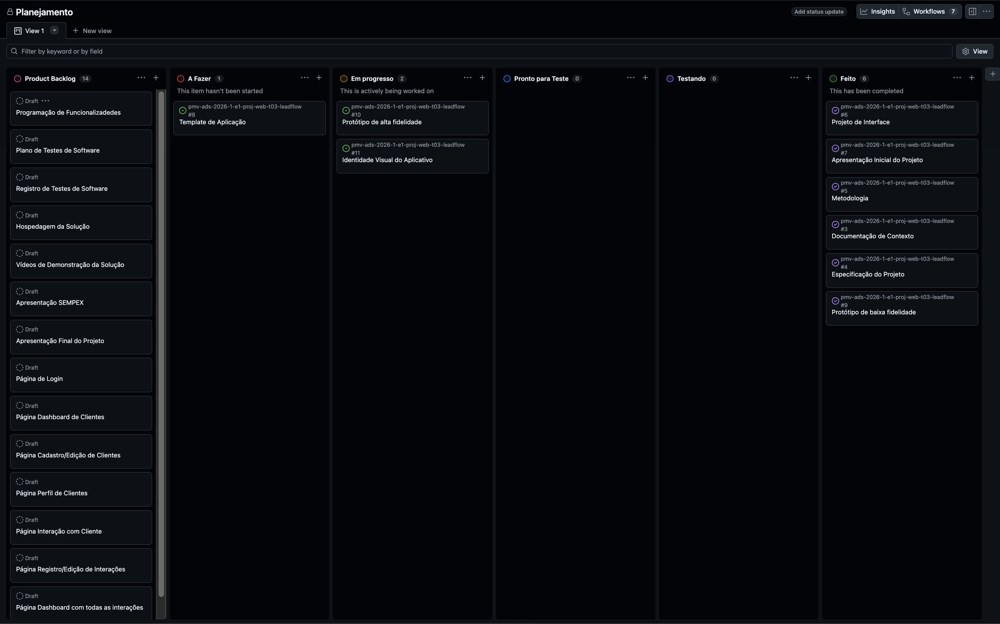
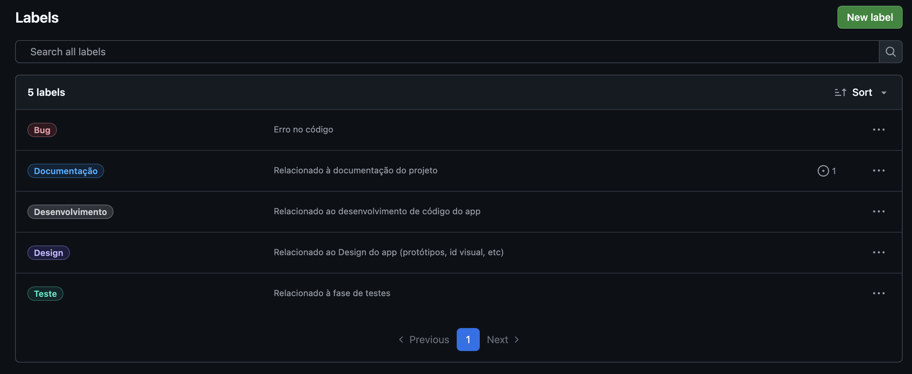

# Metodologia

## Gerenciamento de Projeto

A metodologia SCRUM foi adotada por possibilitar um desenvolvimento iterativo e incremental, facilitando a adaptação a mudanças ao longo do projeto. A abordagem promove uma melhor organização das tarefas e maior colaboração entre os membros da equipe, assegurando entregas contínuas e mais alinhadas às necessidades do sistema.

### Divisão de Papéis

A equipe encontra-se organizada da seguinte maneira:
<ul>
  <li>Scrum Master: Lucas Toth</li>
  <li>Product Owner: Hylbert Honorato</li>
  <li>Equipe de Desenvolvimento: Hylbert Honorato, Lucas Toth</li>
  <li>Equipe de Design: Hylbert Honorato, Lucas Toth</li>
</ul>

### Processo

Para a organização e distribuição das tarefas do projeto, a equipe utiliza o GitHub, estruturado com as seguintes listas:

<ul>
  <li>Backlog: representa o Product Backlog e contempla as tarefas do projeto a serem trabalhadas.</li>
  <li>A Fazer: representa o Sprint Backlog em execução no ciclo atual.</li>
  <li>Em progresso: lista das tarefas que se encontram em desenvolvimento.</li>
  <li>Pronto para Teste: tarefas concluídas e aguardando validação.</li>
  <li>Testando: tarefas em revisão e/ou em fase de testes.</li>
  <li>Feito: tarefas finalizadas.</li>
 </ul>

O quadro Kanban do grupo no GitHub está disponível no link [Projects](https://github.com/orgs/ICEI-PUC-Minas-PMV-ADS/projects/2831) e é apresentado, no estado atual, na figura a seguir:

<figure> 
  Figura 2 - Tela do Kanban no GitHub utilizada pelo grupo</figcaption>
</figure> 

  
<h3>Etiquetas</h3>
As tarefas são classificadas por meio de etiquetas de acordo com a natureza da atividade, seguindo o esquema de cores e categorias descrito abaixo:

<ul>
  <li>Bug</li>
  <li>Desenvolvimento</li>
  <li>Documentação</li>
  <li>Design</li>
  <li>Testes</li>
</ul>

<figure> 
  Figura 3 - Etiquetas e cores</figcaption>
</figure> 
  
### Ferramentas

As ferramentas empregadas no projeto foram:

- VS Code, para edição de código
- Figma, para wireframe e prototipagem
- Adobe Illustrator, para design da identidade visual
- PowerPoint, para edição das apresentações em slides
- Ferramentas de comunicação

O VS Code foi selecionado como editor de código em razão de sua ampla adoção no mercado, suporte a diversas linguagens de programação e integração nativa com o Git, facilitando o controle de versão do projeto. O Figma foi adotado para wireframe e prototipagem por ser uma ferramenta colaborativa baseada em nuvem, permitindo que todos os membros da equipe acessem e editem os protótipos em tempo real. O Adobe Illustrator foi utilizado para o design da identidade visual por oferecer recursos avançados de criação de ilustrações e gráficos vetoriais, garantindo qualidade e escalabilidade aos elementos visuais da aplicação. O PowerPoint foi escolhido para a elaboração das apresentações por sua interface intuitiva e ampla compatibilidade com os ambientes institucionais da universidade. Por fim, as ferramentas de comunicação foram selecionadas por possibilitarem integração com as demais plataformas utilizadas no projeto, centralizando notificações e facilitando a colaboração contínua entre os membros da equipe.

Todos os artefatos relacionados à implementação e à visualização dos conteúdos da aplicação serão inseridos na pasta codigo-fonte.

| AMBIENTE | PLATAFORMA |LINK DE ACESSO                 |
|--------------------|--------------------------------------------------------------------------------|----------------------------------------|
|Documentos do projeto  | GitHub | https://github.com/ICEI-PUC-Minas-PMV-ADS/pmv-ads-2026-1-e1-proj-web-t03-leadflow/blob/main/  |
|Projeto de interface e wireframes | Figma | https://www.figma.com/design/h12tCXLLymxbhya3pHudaF/Leadflow?node-id=0-1&t=DjV3XB6pNSrY1QMw-1 |
|Gerenciamento do projeto  | GitHub | https://github.com/orgs/ICEI-PUC-Minas-PMV-ADS/projects/2831 |

### Estratégia de Organização de Codificação 

Todos os artefatos relacionados à implementação e à visualização dos conteúdos da aplicação serão inseridos na pasta [codigo-fonte](https://github.com/ICEI-PUC-Minas-PMV-ADS/pmv-ads-2026-1-e1-proj-web-t03-leadflow/tree/main/codigo-fonte). 
