# Projeto de Interface

## User Flow

A Figura 1 ilustra o User Flow, representando o fluxo de interação do usuário com o aplicativo. Cada uma das telas desse fluxo é detalhada na seção **Protótipo de baixa fidelidade** a seguir. Para acessar o protótipo interativo no Figma, <a href="https://www.figma.com/proto/h12tCXLLymxbhya3pHudaF/Leadflow?t=7I3yV2MOvD9LcZ2J-1&scaling=min-zoom&content-scaling=fixed&page-id=0%3A1&node-id=4-3343&starting-point-node-id=4%3A3343">clique aqui</a>.

<figure> 
    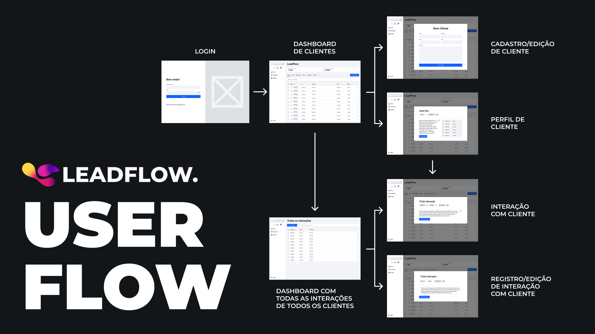
    <figcaption>Figura 1 - Fluxo do usuário no app
</figure> 

## Protótipo de baixa fidelidade

De modo geral, as telas do aplicativo, quando acessadas em sessão autenticada, apresentam uma estrutura comum, conforme ilustrado na Figura 2, composta por três grandes seções:
<ul>
  <li>Menu Lateral - Apresenta o logotipo do aplicativo LeadFlow e a navegação principal da aplicação;</li>
  <li>Header - Apresenta o nome da tela em questão e informações complementares;</li>
  <li>Dashboard - Apresenta as informações principais da tela em questão, sendo o local de maior interação do usuário com o aplicativo.</li>
</ul>

<figure> 
  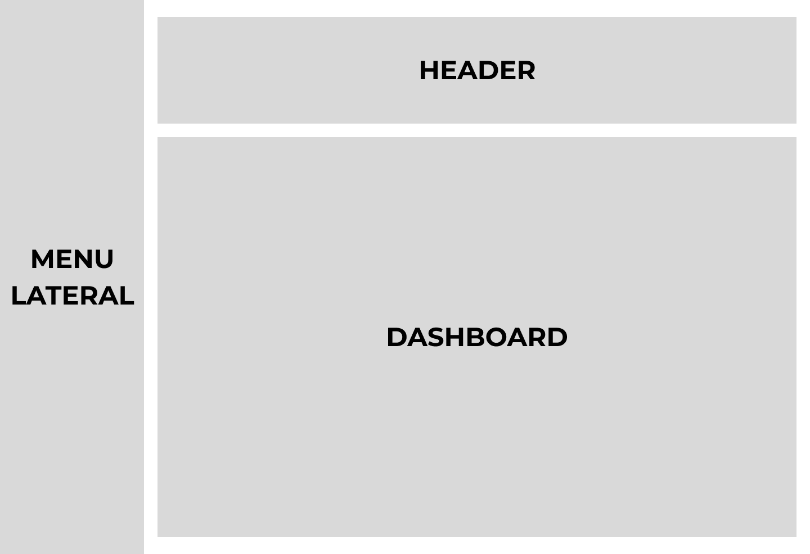Figura 2 - Estrutura padrão do site
</figure> 

<h3><b>Tela 1 - Login</b></h3>
A tela de Login apresenta, no lado esquerdo, uma saudação ao usuário, os campos para inserção de usuário e senha, o botão de Login e um botão para criação de conta, destinado a usuários ainda não cadastrados. O lado direito da tela exibe o logotipo do projeto LeadFlow.
  
<figure> 
  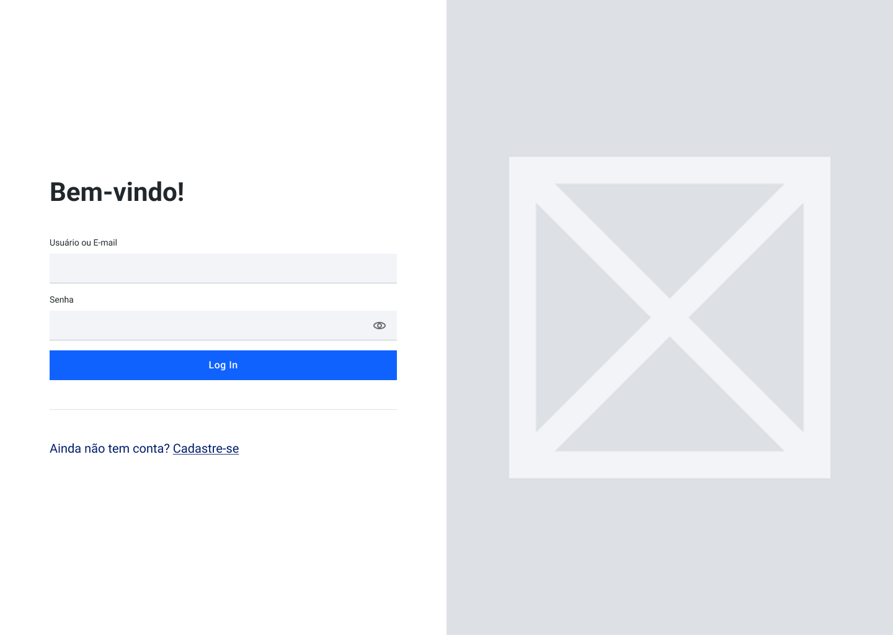Figura 3 - Tela de Login
</figure> 

<h3><b>Tela 2 - Dashboard de Clientes</b></h3>
A tela de Dashboard de Clientes segue a estrutura geral descrita na seção anterior. O menu lateral à esquerda contém a navegação principal do aplicativo. À direita, a tela apresenta as demais seções principais:
    <ul>
        <li>O Header, com o título da página e indicadores relevantes para o usuário;</li>
        <li>O Dashboard principal, com uma lista de todos os clientes cadastrados no sistema, um resumo de suas informações e um botão para o cadastro de novos clientes.</li>
    </ul>  
  
<figure> 
  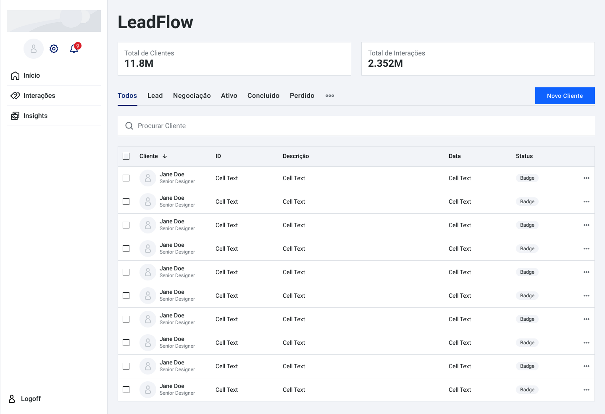Figura 4 - Tela Dashboard de Clientes
</figure> 

<h3><b>Tela 3 - Cadastro/Edição de Cliente</b></h3>
A tela de Cadastro/Edição de Cliente é acionada quando o usuário clica no botão de cadastro de novo cliente disponível na tela anterior. Um modal é exibido por meio de uma animação de fade-in, contendo o título "Novo Cliente" e campos para o preenchimento das informações do cliente. Ao final do formulário, encontra-se o botão "Salvar Cliente".
  
<figure> 
  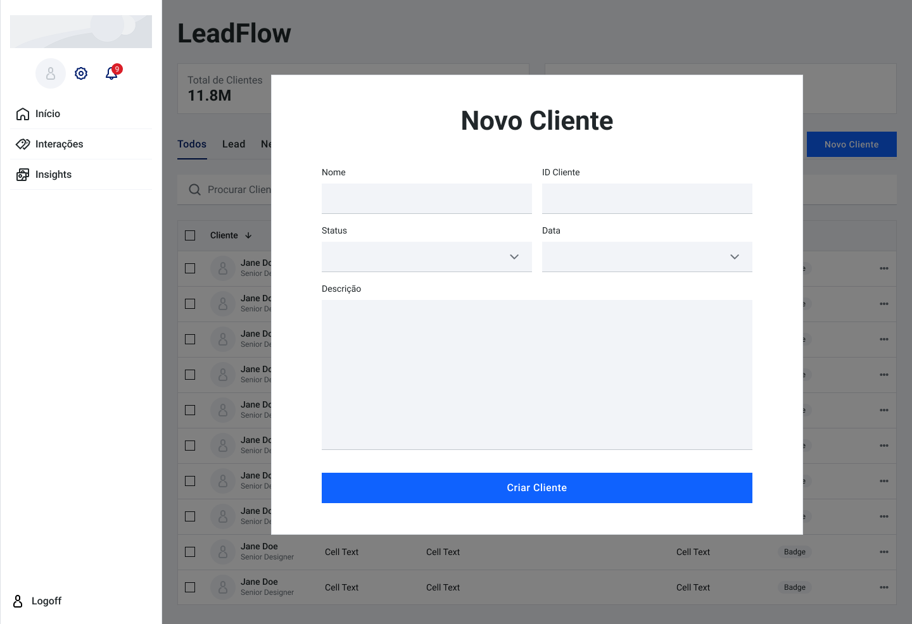Figura 5 - Tela de Cadastro/Edição de Cliente
</figure> 

 
 

> [!WARNING]
> **Nota sobre o campo "ID do Cliente"**  
>  
> Para facilitar o uso do aplicativo, o ID do Cliente é gerado automaticamente, sendo possível, no entanto, que o usuário edite o campo manualmente, caso deseje.

<h3><b>Tela 4 - Perfil de Cliente</b></h3>
A tela de Perfil de Cliente é acionada quando o usuário seleciona um cliente no Dashboard de Clientes. Um modal é exibido por meio de uma animação de fade-in, apresentando o nome do cliente como título. Abaixo, são exibidos dois campos: Status do Cliente e Data de Criação. A tela é então dividida em duas seções: à esquerda, constam a descrição do cliente redigida pelo usuário e um botão para exclusão do cadastro; à direita, um painel rolável com um cabeçalho que permite a filtragem e o registro de interações, seguido de uma lista com todas as interações registradas para aquele cliente.
  
<figure> 
  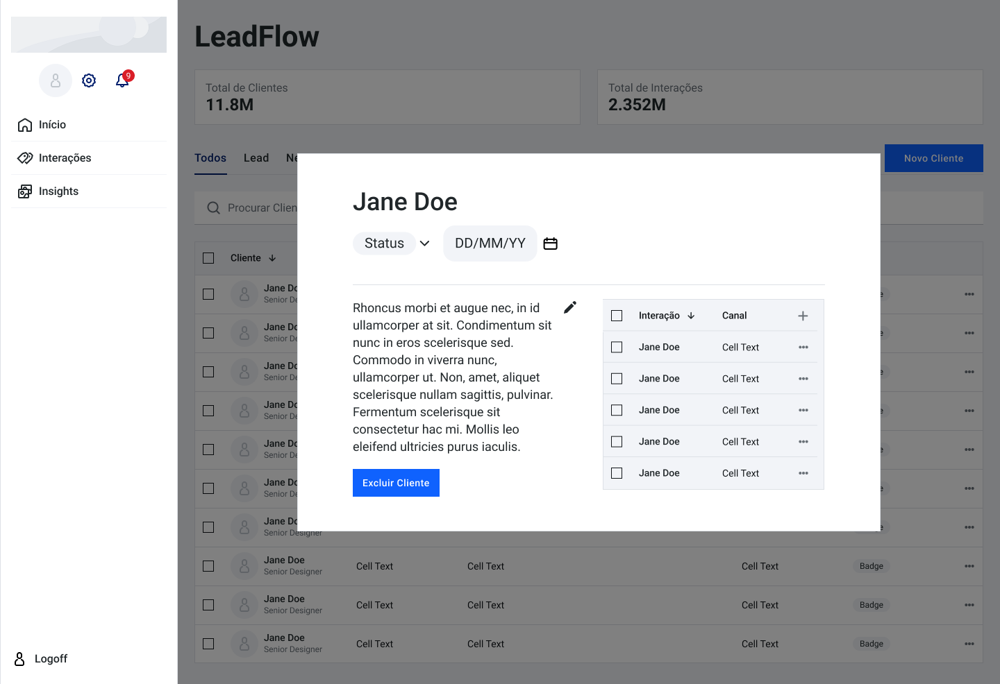Figura 6 - Tela de Perfil de Cliente
</figure> 

<h3><b>Tela 5 - Interação com Cliente</b></h3>
A tela de Interação com Cliente é acionada quando o usuário seleciona um item no painel de interações da tela de Perfil do Cliente ou no Dashboard geral de interações, apresentado adiante nesta seção. Um modal é exibido por meio de uma animação de fade-in, substituindo o anterior, e apresenta o título da interação seguido de três campos: ID do usuário vinculado à interação, canal pelo qual a interação ocorreu e data de criação. Abaixo, constam a descrição da interação registrada pelo usuário e um botão para exclusão. Ao lado de cada campo, há um botão que aciona a função de edição.
  
<figure> 
  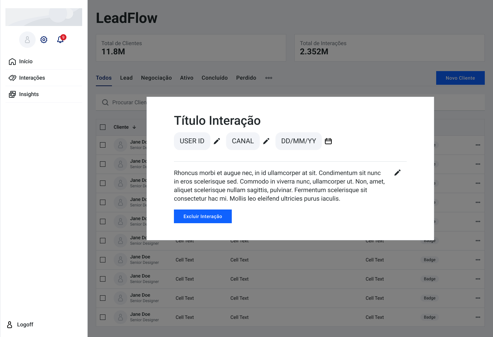Figura 7 - Tela de Interação com Cliente
</figure> 

<h3><b>Tela 6 - Registro/Edição de interação com cliente</b></h3>
A tela de Registro/Edição de Interação com Cliente é acionada quando o usuário clica em um botão de edição de campo disponível na tela anterior ou no botão de Nova Interação nas telas de Perfil do Cliente e Dashboard geral de interações. Um modal é exibido por meio de uma animação de fade-in, substituindo o anterior, com todos os campos da tela anterior habilitados para edição. Ao final, encontra-se o botão para salvar a interação, que é atualizada conforme as edições realizadas pelo usuário.
  
<figure> 
  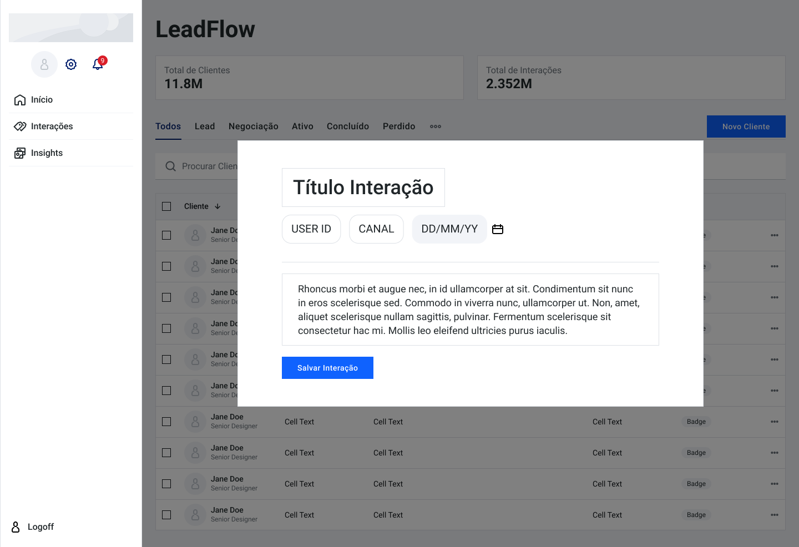Figura 8 - Tela de Registro/Edição de interação com cliente
</figure> 

<h3><b>Tela 7 - Dashboard com todas as interações de todos os clientes</b></h3>
A tela de Dashboard com Todas as Interações de Todos os Clientes segue a estrutura geral descrita anteriormente. O menu lateral à esquerda contém a navegação principal do aplicativo. À direita, a tela apresenta as demais seções principais:
    <ul>
        <li>O Header, com o título da página;</li>
        <li>Um Dashboard que lista todas as interações registradas no sistema, incluindo o nome do cliente — obtido a partir do ID do cliente vinculado à interação —, o canal em que a interação ocorreu e a primeira linha da descrição inserida pelo usuário ao registrá-la. Acima da lista, há um botão para o registro de uma nova interação. Ao acessar a tela de Registro/Edição de Interação por esta página, o campo ID do Cliente é iniciado em branco, cabendo ao usuário inserir o ID correspondente para vincular a interação ao cliente correto.</li>
    </ul>
  
<figure> 
  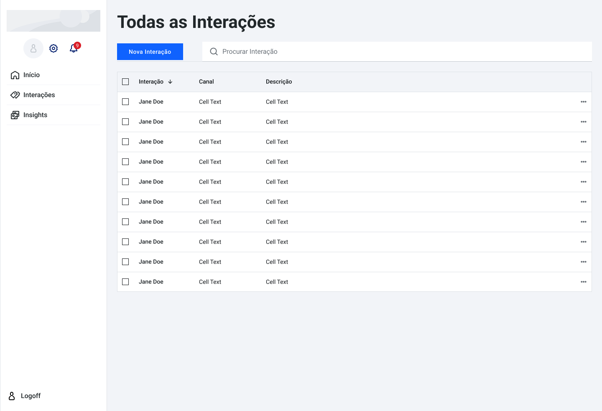Figura 9 - Tela de Dashboard com todas as interações de todos os clientes
</figure> 

## Protótipo de alta fidelidade
Para acessar o protótipo interativo de alta fidelidade no Figma, <a href="https://www.figma.com/proto/h12tCXLLymxbhya3pHudaF/Leadflow?node-id=33-3919&t=Tpd0qpHk9ECv8iAj-1&starting-point-node-id=33%3A3919">clique aqui</a>.

<h3><b>Tela 1 - Login</b></h3>
  
<figure> 
  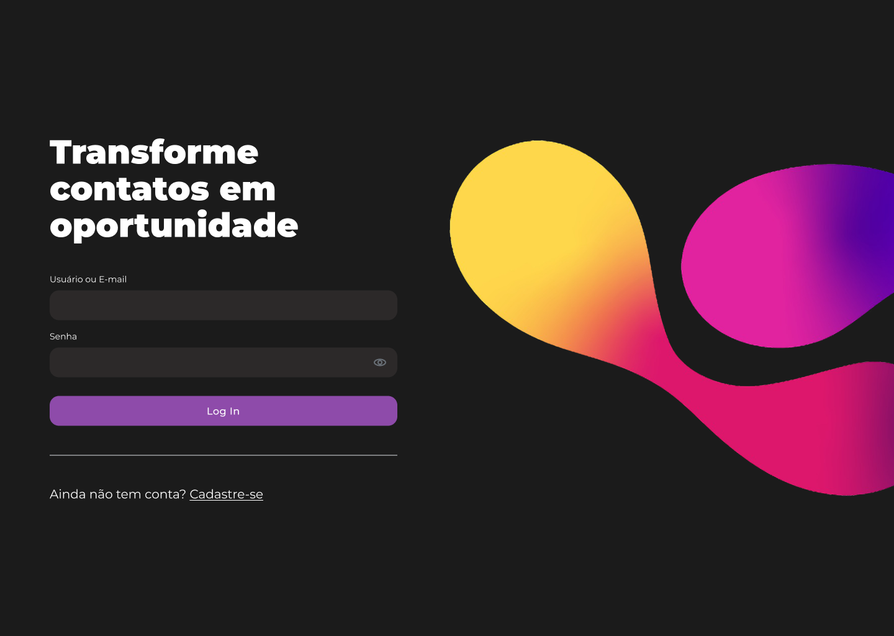Figura 3 - Tela de Login
</figure> 

<h3><b>Tela 2 - Dashboard de Clientes</b></h3>
  
<figure> 
  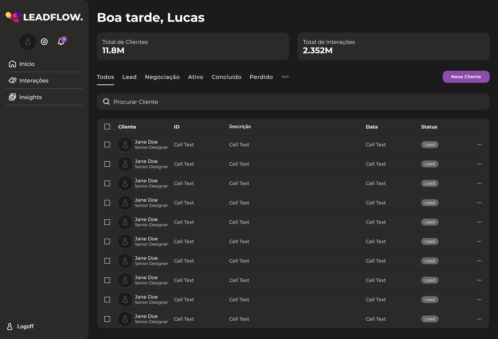Figura 4 - Tela Dashboard de Clientes
</figure> 

<h3><b>Tela 3 - Cadastro/Edição de Cliente</b></h3>
  
<figure> 
  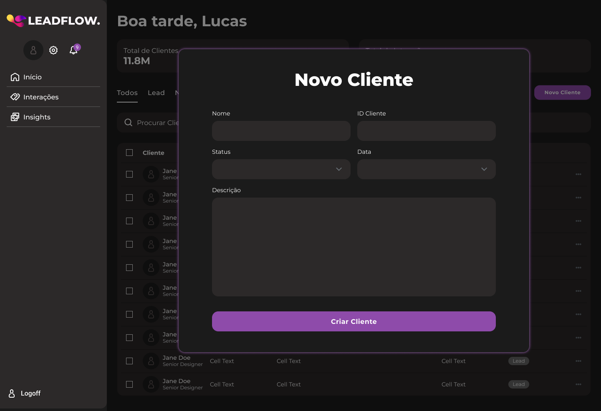Figura 5 - Tela de Cadastro/Edição de Cliente
</figure> 

<h3><b>Tela 4 - Perfil de Cliente</b></h3>
  
<figure> 
  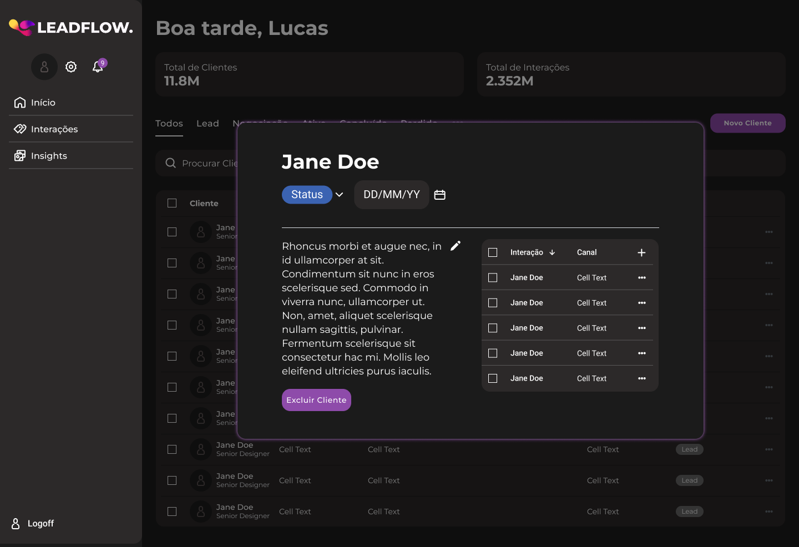Figura 6 - Tela de Perfil de Cliente
</figure> 

<h3><b>Tela 5 - Interação com Cliente</b></h3>
  
<figure> 
  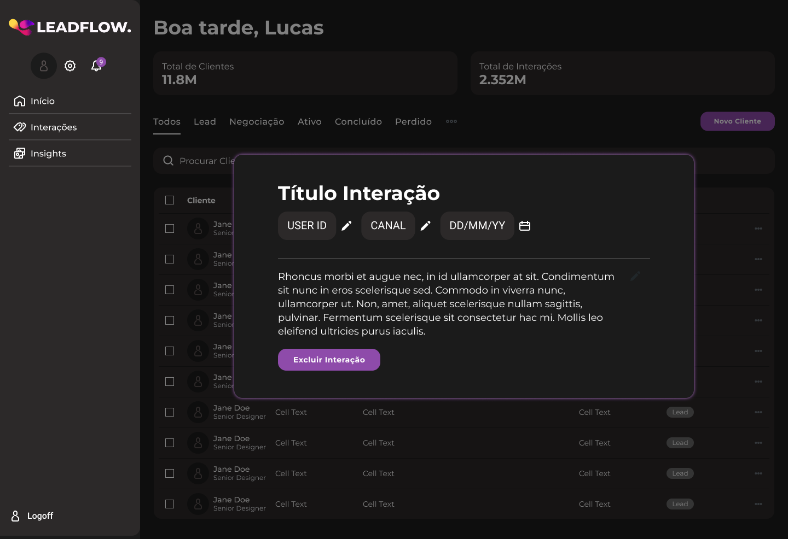Figura 7 - Tela de Interação com Cliente
</figure> 

<h3><b>Tela 6 - Registro/Edição de interação com cliente</b></h3>
  
<figure> 
  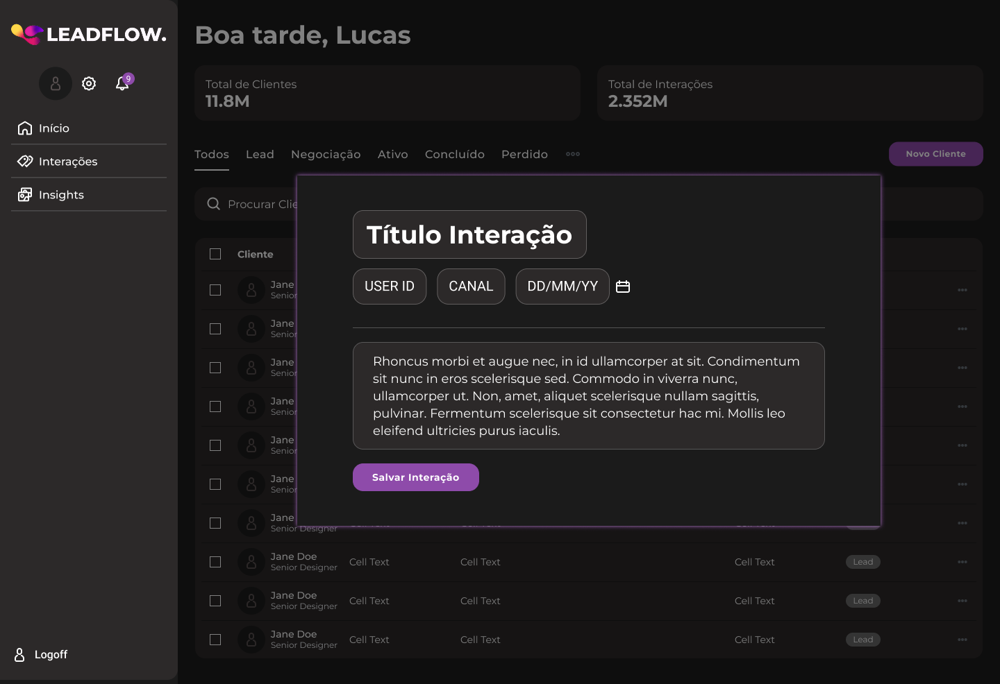Figura 8 - Tela de Registro/Edição de interação com cliente
</figure> 

<h3><b>Tela 7 - Dashboard com todas as interações de todos os clientes</b></h3>
 
<figure> 
  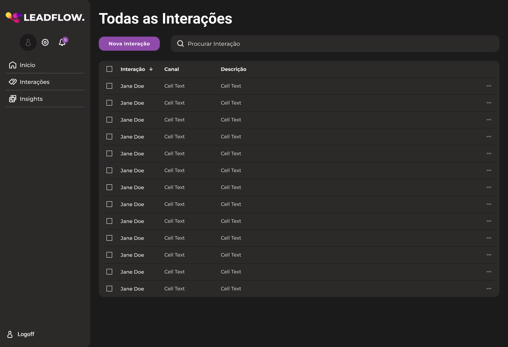Figura 9 - Tela de Dashboard com todas as interações de todos os clientes
</figure> 

