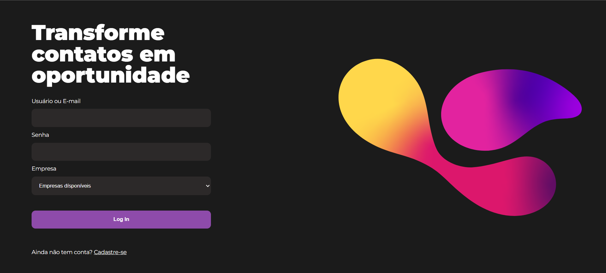
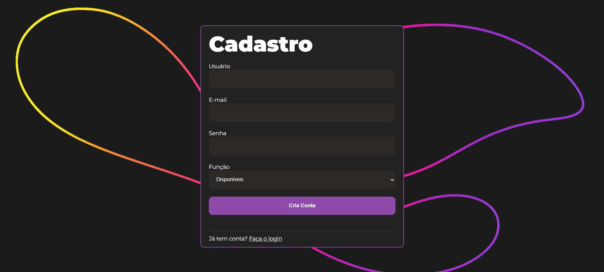
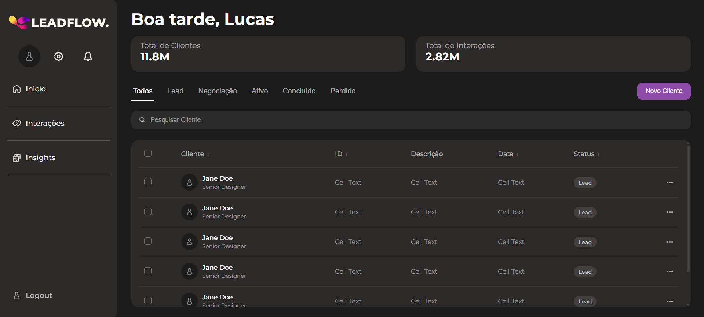
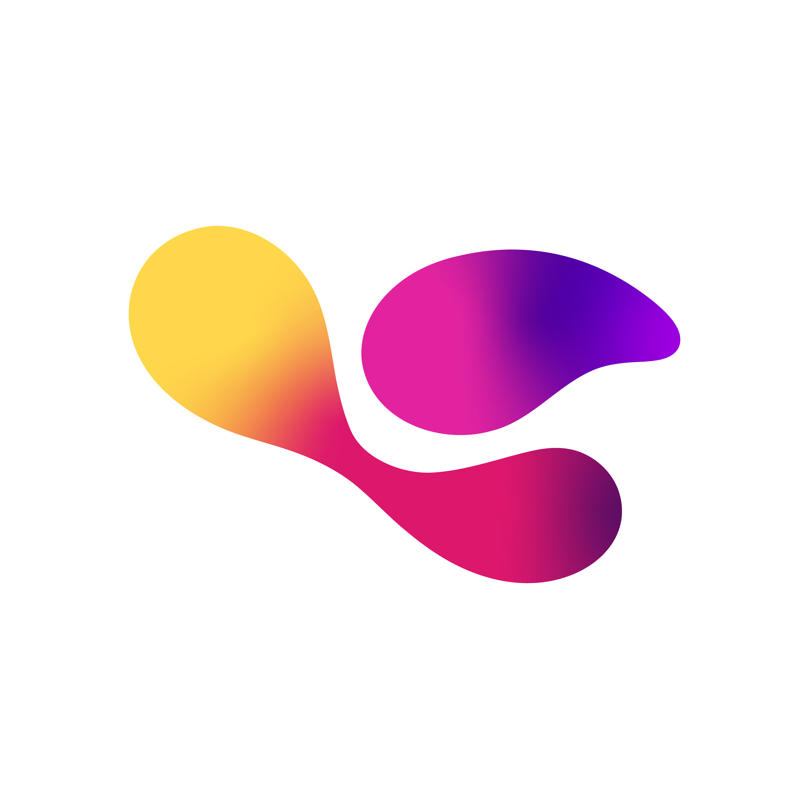

# Template padrão da Aplicação

O layout padrão do site foi construído com as linguagens de marcação HTML e CSS, e a linguagem de programação JavaScript foi utilizada para as funcionalidades de login, autenticação, cadastro, pesquisa de clientes e utilização do LocalStorage do navegador para armazenamento de dados.

As páginas terão como elementos padrões o menu de navegação, o modelo de dashboard e os elementos de identidade visual citados abaixo:

<ul>
<li>Cores: RGB: #8E4BAA, #2C2929, #F2F4F8, #554E4E, #1B1B1B;</li>
<li>Font-family: Montserrat, sans-serif.</li>
<li>Font-size: 10px, 12px, 14px, 16px, 24px, 36px </li>
</ul>
  
O código utilizado para a construção dos elementos citados, incluindo a responsividade, pode ser consultado <a href="../codigo-fonte">aqui</a>. As imagens e ícones utilizados no projeto estão disponíveis <a href="img/">aqui</a>.

<h3><b>Tela de login no sistema</b></h3>

Formulário de login, imagem do logo, botão para cadastro caso não tenha conta.

<figure> 
  
  <figcaption> Figura 1 - Tela de Login
</figure> 

<h3><b>Tela de cadastro no sistema</b></h3>

Formulário de cadastro, imagem do logo ao fundo.

<figure> 
  
  <figcaption> Figura 2 - Tela de Cadastro
</figure> 

<h3><b>Tela do Dashboard de Clientes</b></h3>

Menu lateral com opções relacionadas à conta e páginas do sistema, header com nome do usuário e números de clientes e interações, tabela do dashboard com todos os clientes e opções de pesquisa e filtragem. O Dashboard de Interações também seguirá este mesmo template padrão.

<figure> 
  
  <figcaption> Figura 3 - Tela do Dashboard de Clientes
</figure> 
  
<h3><b>Logo Leadflow</b></h3>

Para a criação do logotipo do CRM foi utilizado um degradê nas cores amarela, rosa e roxa, pois essas cores remetem à clareza, comunicação e tecnologia. A escolha do formato fluido foi pensada para representar conexão e relacionamento, elementos essenciais no gerenciamento de clientes.

<figure> 
  
    <figcaption>Figura 4 - Logotipo da aplicação web LeadFLow
</figure> 
